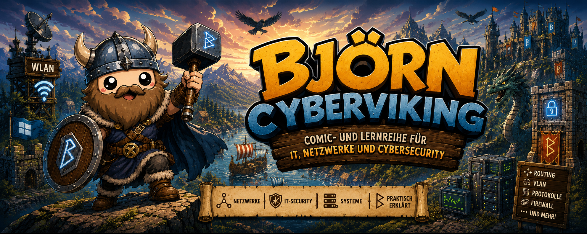

  

# Björn Cyberviking

Björn Cyberviking ist eine Comic- und Lernreihe, die aus einer einfachen Idee entstanden ist: 
IT-Ausbildung darf auch Spaß machen.

Viele Themen aus Netzwerktechnik und Informatik sind zunächst ziemlich abstrakt. Routing-Protokolle, Broadcasts, Datenpakete oder Netzwerktopologien lassen sich technisch erklären – aber gerade für Auszubildende ist es manchmal einfacher, einen Zusammenhang zuerst zu sehen und zu erleben.
Deshalb entstand die Idee, technische Themen in kleine Geschichten und eine Wikingerwelt zu übertragen.
Der erste Teil der Reihe orientiert sich dabei bewusst an Bjorn, dem Cybersecurity-Projekt von infinition. Aus einem Raspberry-Pi-Projekt mit einer kleinen Wikingerfigur entstand die Idee, Björn auf eine Reise durch die Welt der IT zu schicken.
Aus dieser zunächst kleinen Idee entwickelte sich nach und nach eine umfangreichere Comic- und Lernreihe.

Direkter Einstieg in die Comics

- [Björn Die Netzwerksaga](/comics/Bjoern-Netzwerksaga-SD.pdf)
- [Björn Die Angriffssaga](/comics/Bjoern-Angriffssaga-SD.pdf)
- [Björn Das Netzwerkreich Kapitel 1](/comics/Bjoern-Netzwerkreich-C1.pdf)
- [Björn Das Netzwerkreich Kapitel 2](/comics/Bjoern-Netzwerkreich-C2.pdf)

Matchingtabelle der Comics und Module/Curricula

- [FISI Modul-Matchingtable](/learn/SI-NW-Matchingtable.pdf)

Unterrichtseinheiten

- [FISI Modul 01 Präsentation](/teach/SI-NW-01.odp)
- [FISI Modul 01 Unterrichtsvorbereitung](/teach/SI-NW-01-Lesson.pdf)
- [FISI Modul 01 Lernkontrolle](/teach/SI-NW-01-Test.pdf)
- [FISI Modul 02 Präsentation](/teach/SI-NW-02.odp)
- [FISI Modul 02 Unterrichtsvorbereitung](/teach/SI-NW-02-Lesson.pdf)
- [FISI Modul 02 Lernkontrolle](/teach/SI-NW-02-Test.pdf)
- [FISI Modul 03 Präsentation](/teach/SI-NW-03.odp)
- [FISI Modul 03 Unterrichtsvorbereitung](/teach/SI-NW-03-Lesson.pdf)
- [FISI Modul 03 Lernkontrolle](/teach/SI-NW-03-Test.pdf)

Unterrichtsmaterial Netzwerke

- [Curriculum Kapitel 1](/learn/Bjoern-Netzwerkreich-C1-Curriculum.pdf)
- [Curriculum Kapitel 2](/learn/Bjoern-Netzwerkreich-C2-Curriculum.pdf)
- [FISI Modul 01-Netzwerkgrundlagen](/learn/SI-NW-01.pdf)
- [FISI Modul 02-Endgeräte und Kommunikation](/learn/SI-NW-02.pdf)
- [FISI Modul 03-Datenübertragung](/learn/SI-NW-03.pdf)
- [FISI Modul 03-Technische Informationen](/learn/SI-NW-03-Techinfo.pdf)
- [FISI Modul 04-Topologien und Strukturen](/learn/SI-NW-04.pdf)
- [FISI Modul 05-Kommunikationsarten](/learn/SI-NW-05.pdf)
- [FISI Modul 06-Netzwerkmodelle und OSI](/learn/SI-NW-06.pdf)
- [FISI Modul 07-Netzwerkprotokolle und Dienste](/learn/SI-NW-07.pdf)
- [FISI Modul 08-IP-Adressierung](/learn/SI-NW-08.pdf)
- [FISI Modul 09-Subnetting](/learn/SI-NW-09.pdf)
- [FISI Modul 10-Switching und MAC Kommunikation](/learn/SI-NW-10.pdf)
- [FISI Modul 11-VLAN und Netzwerksegmentierung](/learn/SI-NW-11.pdf)
- [FISI Modul 12-Routing](/learn/SI-NW-12.pdf)
- [FISI Modul 13-NAT](/learn/SI-NW-13.pdf)
- [FISI Modul 14-DHCP](/learn/SI-NW-14.pdf)
- [FISI Modul 15-DNS](/learn/SI-NW-15.pdf)

Unterrichtsmaterialien zu LLM/AI

- [LLM Modul 01-Was ist ein LLM](/learn/SI-LLM-01.pdf)
- [LLM Modul 02-Tokens und Predicttions](/learn/SI-LLM-02.pdf)
- [LLM Modul 03-Context und Memory](/learn/SI-LLM-03.pdf)
- [LLM Modul 14-Prompt Injection](/learn/SI-LLM-14.pdf)
---

## Die Entstehung von Björn

Die Idee zu Björn Cyberviking entstand durch das Open-Source-Projekt [Bjorn](https://github.com/infinition/Bjorn) von **infinition**.
Bjorn ist ein Raspberry-Pi-Projekt, das ein spielerisches Cybersecurity-Konzept mit einer Wikingerfigur verbindet. Nachdem Bjorn auf einem Raspberry Pi Zero W aufgebaut wurde, entstand die Idee, die Figur für etwas völlig anderes einzusetzen: als Ausgangspunkt für humorvolle Erklärungen von IT-Themen.

Björn Cyberviking ist kein offizieller Bestandteil des ursprünglichen Bjorn-Projekts und steht in keiner offiziellen Verbindung zu dessen Autor. Die Comicreihe ist eine eigenständige kreative und didaktische Weiterentwicklung.

---

## Die Idee hinter der Reihe

Björn reist durch eine Welt, in der technische Konzepte eine sichtbare Form bekommen.

Netzwerke werden zu Landschaften und Wegen. Datenpakete können reisen. Routing-Protokolle treffen Entscheidungen. Ein Broadcast kann plötzlich ein Problem für ein ganzes Dorf werden.
Die Geschichten sollen dabei nicht die technische Erklärung ersetzen.
Die Wikingerwelt dient als visuelle Metapher. Sie soll helfen, technische Zusammenhänge zunächst intuitiv zu erfassen, bevor die eigentlichen technischen Hintergründe erklärt werden.
Das Ziel ist nicht, Informatik so weit zu vereinfachen, dass sie fachlich falsch wird.

Das Ziel ist, einen Einstieg zu schaffen, der im Gedächtnis bleibt.

---

## Für wen ist die Reihe gedacht?

Ursprünglich entstand Björn Cyberviking für die Auszubildenden in einer IT-Abteilung.
Die Inhalte richten sich vor allem an Menschen, die sich mit den Grundlagen der Informatik, Netzwerktechnik und IT-Security beschäftigen. Sie sollen aber auch für andere IT-Interessierte verständlich sein.
Aber auch Tutoren und Ausbilder finden hier Material zur Unterrichtsvorbereitung und Lernerfolgskkntrolle.
---

## Themen

Die Reihe wird schrittweise erweitert. Dazu gehören unter anderem:

- Grundlagen der Informatik
- Netzwerkkommunikation
- Unicast und Broadcast
- IP-Adressierung und Subnetting
- Routing
- BGP
- OSPF
- VLANs
- MTU und Paketfragmentierung
- TCP und UDP
- DNS und DHCP
- Firewalls und Netzwerksegmentierung
- Grundlagen der IT-Security

---

## Aufbau eines Kapitels

Je nach Thema besteht ein Kapitel aus mehreren Teilen:

1. **Comic**  
   Björn begegnet einem technischen Problem und erlebt das Thema in der Wikingerwelt.

2. **Technische Erklärung**  
   Die Geschichte wird in den tatsächlichen technischen Kontext eingeordnet.

3. **Zusammenfassung**  
   Die wichtigsten Begriffe und Zusammenhänge werden kompakt zusammengefasst.

4. **Notizen und Übungen**  
   Platz für eigene Ergänzungen und Gedanken.

---

## Projektstatus

Björn Cyberviking befindet sich in Entwicklung.

Die Reihe ist ursprünglich als Lernmaterial für die Ausbildung entstanden und wird Schritt für Schritt erweitert. Neue Themen und Kapitel kommen hinzu, wenn aus einer technischen Idee auch eine gute Geschichte für Björn werden kann.

---

## Lizenz

Die Lizenzierung der eigenen Inhalte dieses Projekts wird im Repository gesondert geregelt.

Das ursprüngliche Projekt Bjorn von infinition und dessen Lizenzierung werden ebenfalls separat dokumentiert.
